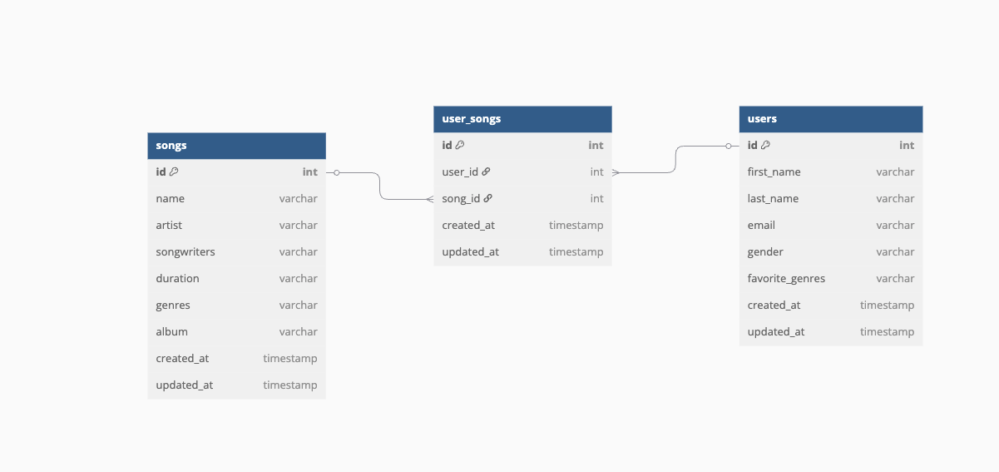

# Réponses du test

## _Utilisation de la solution (étape 1 à 3)_

### Pour lancer la pipeline

1. Lancer l'api Moovitamix:

```
make run_api
```

2. Lancer le serveur Prefect ( Orchestrateur )

```
make run_prefect_server
```

3. Lancer le plannificateur de tâche

```
make run_scheduler
```

4. Lancer la tâche pour tester la pipeline de données

```
make run_pipeline
```

Lancer les tests :

```
make test
```

Pour accéder à l'UI de Prefect : http://127.0.0.1:4200

## Questions (étapes 4 à 7)

### Étape 4

_Détailler le schéma de la base de données que vous utiliseriez pour stocker les informations récupérées des trois sources de données mentionnées plus tôt. Quel système de base de données recommanderiez-vous pour répondre à ces besoins et pourquoi?_

Nous avons des données structurées, instictivement je pense donc à du SQL qui est le type de base de données le plus populaire dans ce domaine. Je pense que ce type convient complétement dans notre architecture. Les données ont des relations fortes , il est possible d'utiliser une contrainte d'unicité lors d'une requête d'insertionest faite avec ON CONFLICT DO NOTHING ou d'update comme ON CONFLICT DO UPDATE pour éviter de surcharger la base de données avec des data en double. Enfin dans le contexte plus global de notre architecture cela permet d'avoir une base de données **source vérité** qui peux nous être utilse par la suite. Bien ques les base de donnée NOSQL peuvent avoir leur rôle à jouer dans des contextes spécifique ( rapidité, scalabilité ), ici une base de donnée SQL est plus intéressante. Aujourd'hui je pense que choisir postgresql est une valeur sûre pour de la production comparé à d'autre noms comme MySQL ou SQLite ( je parle de base de données on pre-mise et ne prend pas en compte le cloud )

Schéma de la base de donnée :



### Étape 5

_Le client exprime le besoin de suivre la santé du pipeline de données dans son exécution quotidienne. Expliquez votre méthode de surveillance à ce sujet et les métriques clés._

Dans un premier temps, il est important de bien logger la pipeline.  
Actuellement, il est possible de retrouver les logs directement dans l'interface Prefect.  
Il est envisageable par la suite de logger dans un document ou dans une base de données type **Elasticsearch**.

La méthode de surveillance serait, pour moi, orientée dans trois directions :

- Avoir des notifications pour les erreurs critiques, par exemple par email
- Accès aux logs pour déboguer la pipeline de données si nécessaire
- Accès à un tableau de bord qui recapitule les métriques

Ces deux éléments peuvent être mis en place via des outils comme **Grafana**, **Prometheus** ou **AWS CloudWatch**.

#### Liste non exhaustive des métriques utiles pour la supervision de la pipeline :

##### 1. Général

- Temps total d'exécution de chaque lancement
- Compteur d'exécutions réussies / échouées
- Temps écoulé depuis le déploiement
- Latence entre les services (API, base de données)
- Utilisation hardware (CPU, RAM, etc.)

##### 2. Extraction

- Temps de requête moyen ou par endpoint
- Nombre de nouvelles données récupérées à chaque exécution
- Nombre de requêtes

### Étape 6

_Dessinez et/ou expliquez comment vous procèderiez pour automatiser le calcul des recommandations._

Dans un premier temps, je pense que pour utiliser les données dans un contexte d'algorithme en production, il serait nécessaire d'avoir une autre base de données que PostgreSQL.  
Je suggère un **data lake** de type **DuckDB** ou **S3** pour accéder aux données facilement, que ce soit pour les **data scientists** ou les **modèles** par la suite.

Ensuite, pour le calcul des recommandations, il existe deux voies possibles :

- par **batch**
- ou en **temps réel**

Au vu de notre architecture, je vais plutôt choisir la **prédiction par batch**, par exemple toutes les 24h.

En partant sur une architecture avec de la prédiction en batch, il faut faire des prédictions à un temps donné pour chaque utilisateur avec :

- récupération des données qui correspondent à l'utilisateur et qui sont nécessaires à la prédiction
- transformation des données brutes en _features_ que le modèle a utilisées pour apprendre
- chargement du modèle pour l'utiliser (ou interrogation d'une autre API où le modèle est déjà chargé)
- retour du résultat

Les résultats seront stockés dans PostgreSQL et récupérable via une API pour l'application

### Étape 7

_Dessinez et/ou expliquez comment vous procèderiez pour automatiser le réentrainement du modèle de recommandation._

J'utiliserais un orchestrateur comme Prefect ou Airflow pour effectuer et gérer les tâches suivantes :

**Déclencheur :**

- Résultat du modèle en baisse
- Planification (par exemple, chaque semaine)

**Collecte des données :**

Extraction des données nécessaires

**Pré-traitement :**

Script de nettoyage et création de features.

**Réentraînement :**

Réentraînement à l'aide d'une pipeline préalablement créée, de type scikit-learn.

**Évaluation :**

Utilisation de métriques pour évaluer le modèle et déterminer s’il possède au minimum des capacités équivalentes au modèle précédent.

**Déploiement / mise en production :**

Versionnage et sauvegarde du modèle (utilisation d’outils comme MLflow).

# Pour information, l'IA a été utilisé pour générer du code
